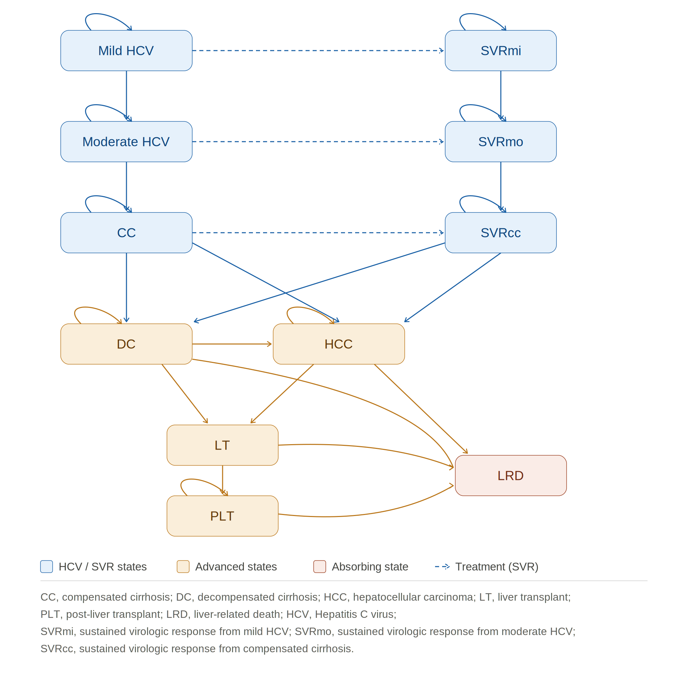

## Introduction

In United Kingdom, an estimated 110 thousand people are infected with hepatitis C virus (HCV) and 90% of the chronically infected people are genotype 1 [@NICE2015TA363; @PHE2020HCV]. In addition, the prevalence of HCV infection in men is found to be disproportionally higher than women in Europe (Baden, 2014). HCV infection is the cause of cirrhosis, liver failure and liver-related death, but in a comparatively slow progressing rate. Treatments are aided to prevent advanced liver damage and liver cancer development. Previously, one of the standard treatments of HCV genotype 1 is the combination therapy of peginterferon plus ribavirin (PR) that requires a 48 weeks course of treatment [@NICE2004TA75]. The introduction of direct-acting antiviral (DAA) has shortened the duration of the treatment to 12 weeks and sustained virological response (SVR) are achieved in more than 95 % of the patients [@WHO2016]. However, the benefits of DAA treatment come with a huge cost, imposing a cost ranging from £30000 to £60000 per patient.

The aim of this study is to estimate the cost-effectiveness of DAA treatment against the previously recommended PR treatment of HCV male patients with genotype 1 from a National Health services (NHS) perspective.

```{r}
#| echo: false
library(tidyverse)
library(gt)
library(here)
```

## Method

### Overview

A Markov model was used to evaluate the cost-effectiveness of DAA treatment of genotype 1 male patients, compared to the usual practice of peginterferon treatment from the NHS perspective in the UK. The costs and the effects of the DAA treatment versus the PR treatment were calculated for a cohort of 397 patients that were diagnosed with different liver fibrosis stages [@Mohsen2001] and were expressed in terms of ICER. The cohort of patients were generated from five centres across the Trent region with age over 40. This report assumed that the mean age of the HCV patients was 45-year-old and the cohort was genotype 1. Patients were retreated until they entered SVR states.

### Model structure

The Markov model was designed according to the natural history of chronic hepatitis C, as presented in @fig-markov-model. The model was simulated annually for a time horizon of 30 years, estimating the long-term effect of the treatment and representing the chronic nature of hepatitis C. It included 11 health states, mild HCV, moderate HCV, compensated cirrhosis (CC), decompensated cirrhosis (DC), Hepatocellular carcinoma (HCC), Liver Transplant (LT), post-liver transplant (PLT), SVR from mild HCV, moderate HCV and CC (SVRmi, SVRmo, SVRcc) and liver-related death (LRD). Patients from DC, HCC, LT, PLT were assumed to face mortality risk in LRD, whereas the patients in the remaining health states were exposed to age and sex-specific probabilities of all-causes death.

{#fig-markov-model}

### Transition Probabilities

Meta-analysis of Histological Data in Viral Hepatitis (**METAVIR)** scoring system was employed to reflect the progression of liver fibrosis stage (F0-F2 are defined as mild HCV; F3 is defined as moderate HCV; F4 is defined as compensated cirrhosis). Transition probabilities between various stages of disease progression were based on systematic review and published economic evaluations [@Coffin2012; @Grieve2006; @Shepard2007] in @tbl-param-table**.** Patients can remain in their current health state or progress to the next worse health state except the LT health state which forced patient to move to PLT or LRD health states in the subsequent cycle. The progression of the disease can be stopped by the treatment. Patients who achieved SVR mild and SVR moderate from mild HCV and moderate HCV were assumed to be fully cured and liver damage is reversed. In addition, even if patients from CC had successful treatment, they had the chance to experience regression of liver fibrosis and develop to advanced liver damage (move from SVRcc to DC). The age and sex-specific probabilities of all-causes death were derived from the latest published national life table by the Office of National Statistics in the UK in 2020.

### Treatment efficacy

Treatment efficacy was measured by sustained virological response (SVR) which means that the RNA of HCV virus was not detected in the patient’s blood stream after 12 weeks of treatment. For patients with mild and moderate HCV, the SVR rate of the PR treatment is 60% and 51% respectively and 78% with DAA treatment for both health states. The SVR rate for patients with CC who received PR treatment is 33% and 56% for those who received DAA treatment (the rates above were not expressed in terms of annual probability). SVR rates were collected specifically for genotype 1 patients from clinical trial and meta-analysis [@Bruno2010; @WHO2016]. The efficacy parameters of DAA and PR treatments were converted to annual probability of reaching SVR per annual cycle and were given in table 1.

### Costs

Costs applied to this study were derived from 2 stages. Intervention cost and health states cost were estimated separately. For model simplicity, this study only included the drug costs of the DAA treatment and PR treatment, leaving the indirect medical costs (costs of monitoring, additional management etc.) excluded. The total drug costs of PR treatment were calculated for 48 weeks of combination therapy (peginterferon alfa-2a 180 µg/0.5 ml per week plus ribavirin 1000-1200mg per day) is £16543. Regarding to DAA treatment, a dosage of Sofosbuvir 400mg and 1000mg ribavirin per day comprised to the total drug costs of £39636 for a 12 weeks course of treatment [@NICE2015TA330].

Health State costs were taken from the observational study conducted during the UK mild HCV trial in 2005. For the costs of liver transplant and post-liver transplant, data were extracted from a programme funded by Department of Health in 2001 (table 1). This study assumed that there were costs incurred even if patients were fully cured and achieved SVR health states.

Intervention costs and Health states costs were reported in 2002/03 GBP and 2015 GBP in the literatures and this study adjusted the costs through Consumer Price Index (CPI) to 2020 GBP. Future costs were discounted at a rate of 3.5% in regards to the current NICE guideline

### Health States Utilities

The health state utilities were expressed in terms of Quality-adjusted life years (QALYs). These health outcomes were extracted from the UK Mild HCV trial in 2005. Patients were given SF-36 questionnaire during treatment and follow-up. To be in line with the current NICE guidance, a discount rate of 3.5% was applied to future health outcomes.

```{r}
#| echo: false
model_params <- tribble(
  ~Section, ~From, ~To, ~Parameter, ~Mean, ~Distribution, ~Source,

  "Transition probabilities", "Mild HCV", "Moderate HCV", "Transition probability", 0.025, "Beta (α = 38.0609, β = 1484.3765)", "Grieve (2006)",
  "Transition probabilities", "Moderate HCV", "Compensated cirrhosis", "Transition probability", 0.037, "Beta (α = 26.8680, β = 699.2952)", "Grieve (2006)",
  "Transition probabilities", "Compensated cirrhosis", "Decompensated cirrhosis", "Transition probability", 0.039, "Beta (α = 14.5778, β = 359.2122)", "Grieve (2006)",
  "Transition probabilities", "Compensated cirrhosis", "Hepatocellular carcinoma", "Transition probability", 0.014, "Beta (α = 1.9186, β = 135.1214)", "Grieve (2006)",
  "Transition probabilities", "SVR after cirrhosis", "Decompensated cirrhosis", "Transition probability", 0.003, "Beta (α = 1976.5905, β = 589816.9695)", "Coffin (2012)",
  "Transition probabilities", "Decompensated cirrhosis", "Hepatocellular carcinoma", "Transition probability", 0.014, "Beta (α = 1.9816, β = 135.1214)", "Grieve (2006)",
  "Transition probabilities", "Decompensated cirrhosis", "Liver transplant", "Transition probability", 0.030, "Beta (α = 6.5256, β = 210.9945)", "Shepard (2001)",
  "Transition probabilities", "Decompensated cirrhosis", "Liver-related death", "Transition probability", 0.130, "Beta (α = 146.9000, β = 983.1000)", "Grieve (2006)",
  "Transition probabilities", "Hepatocellular carcinoma", "Liver transplant", "Transition probability", 0.000, "N/A", "Grieve (2006)",
  "Transition probabilities", "Hepatocellular carcinoma", "Liver-related death", "Transition probability", 0.430, "Beta (α = 116.6733, β = 154.6600)", "Grieve (2006)",
  "Transition probabilities", "Liver transplant", "Liver-related death", "Transition probability", 0.210, "Beta (α = 16.2762, β = 61.2294)", "Shepard (2001)",
  "Transition probabilities", "Liver transplant", "Post-liver transplant", "Transition probability", 0.790, "N/A", "Shepard (2001)",
  "Transition probabilities", "Post-liver transplant", "Liver-related death", "Transition probability", 0.057, "Beta (α = 22.9017, β = 378.8825)", "Shepard (2001)",

  "Treatment efficacy: DAA", "Mild HCV", "SVR mild", "Treatment efficacy", 0.9985, "Beta (α = 7, β = 2)", "WHO (2016)",
  "Treatment efficacy: DAA", "Moderate HCV", "SVR moderate", "Treatment efficacy", 0.9985, "Beta (α = 7, β = 2)", "WHO (2016)",
  "Treatment efficacy: DAA", "Compensated cirrhosis", "SVR cirrhosis", "Treatment efficacy", 0.9704, "Beta (α = 15, β = 12)", "WHO (2016)",

  "Treatment efficacy: PR", "Mild HCV", "SVR mild", "Treatment efficacy", 0.480, "Beta (α = 145, β = 97)", "Bruno (2010)",
  "Treatment efficacy: PR", "Moderate HCV", "SVR moderate", "Treatment efficacy", 0.400, "Beta (α = 32, β = 31)", "Bruno (2010)",
  "Treatment efficacy: PR", "Compensated cirrhosis", "SVR cirrhosis", "Treatment efficacy", 0.250, "Beta (α = 11, β = 25)", "Bruno (2010)",

  "Health-state utilities", "Mild HCV", NA, "Utility", 0.770, "Beta (α = 521.2375, β = 155.6943)", "Grieve (2006)",
  "Health-state utilities", "Moderate HCV", NA, "Utility", 0.660, "Beta (α = 115.7060, β = 59.6063)", "Grieve (2006)",
  "Health-state utilities", "Compensated cirrhosis", NA, "Utility", 0.550, "Beta (α = 47.1021, β = 38.5381)", "Grieve (2006)",
  "Health-state utilities", "Decompensated cirrhosis", NA, "Utility", 0.450, "Beta (α = 123.7500, β = 151.2500)", "Grieve (2006)",
  "Health-state utilities", "Hepatocellular carcinoma", NA, "Utility", 0.450, "Beta (α = 123.7500, β = 151.2500)", "Grieve (2006)",
  "Health-state utilities", "Liver transplant", NA, "Utility", 0.450, "Beta (α = 123.7500, β = 151.2500)", "Grieve (2006)",
  "Health-state utilities", "Post-liver transplant", NA, "Utility", 0.670, "Beta (α = 59.2548, β = 29.1825)", "Martin (2016)",
  "Health-state utilities", "SVR mild", NA, "Utility", 0.820, "Beta (α = 65.8678, β = 14.4588)", "Martin (2016)",
  "Health-state utilities", "SVR moderate", NA, "Utility", 0.720, "Beta (α = 58.0608, β = 22.5792)", "Martin (2016)",
  "Health-state utilities", "SVR cirrhosis", NA, "Utility", 0.610, "Beta (α = 58.0476, β = 37.1124)", "Martin (2016)",

  "Health-state costs", "Mild HCV", NA, "Annual cost (£)", 201, "CPI × Gamma (α = 25.6995, β = 5.3698)", "Wright (2005)",
  "Health-state costs", "Moderate HCV", NA, "Annual cost (£)", 1046, "CPI × Gamma (α = 88.8502, β = 8.0698)", "Wright (2005)",
  "Health-state costs", "Compensated cirrhosis", NA, "Annual cost (£)", 1660, "CPI × Gamma (α = 24.2342, β = 46.9584)", "Wright (2005)",
  "Health-state costs", "Decompensated cirrhosis", NA, "Annual cost (£)", 13306, "CPI × Gamma (α = 36.0249, β = 253.1582)", "Wright (2005)",
  "Health-state costs", "Hepatocellular carcinoma", NA, "Annual cost (£)", 11857, "CPI × Gamma (α = 18.1081, β = 448.8045)", "Wright (2005)",
  "Health-state costs", "Liver transplant", NA, "Annual cost (£)", 39876, "CPI × Gamma (α = 89.7536, β = 304.5004)", "Longworth (2001)",
  "Health-state costs", "Liver transplant care", NA, "Additional cost (£)", 13799, "CPI × Gamma (α = 13.7788, β = 686.4168)", "Longworth (2001)",
  "Health-state costs", "Post-liver transplant", NA, "Annual cost (£)", 2020, "CPI × Gamma (α = 15.2189, β = 91.0053)", "Longworth (2001)",
  "Health-state costs", "SVR mild/moderate/cirrhosis", NA, "Annual cost (£)", 377, "CPI × Gamma (α = 28.8141, β = 8.9887)", "Wright (2005)"
)
```

```{r}
#| echo: false
#| label: tbl-param-table


model_params %>%
  mutate(
    Section = case_when(
      Section == "Transition probabilities" ~ "Transition probabilities",
      Section %in% c("Treatment efficacy: DAA", "Treatment efficacy: PR") ~ "Treatment efficacy (in probability)",
      Section == "Health-state utilities" ~ "Health States Utilities",
      Section == "Health-state costs" ~ "Health States Costs (Adjusted) in £",
      TRUE ~ Section
    ),
    Treatment = case_when(
      str_detect(Section, "Treatment efficacy") &
        Source == "WHO (2016)" ~ "DAA Treatment",
      str_detect(Section, "Treatment efficacy") &
        Source == "Bruno (2010)" ~ "PR Treatment",
      TRUE ~ NA_character_
    ),
    To = replace_na(To, "—"),
    Mean = case_when(
      Parameter %in% c("Annual cost (£)", "Additional cost (£)") ~ 
        paste0("£", format(round(Mean, 0), big.mark = ",")),
      TRUE ~ 
        format(round(Mean, 4), nsmall = 3)
    )
  ) %>%
  select(Section, Treatment, From, To, Mean, Distribution, Source) %>%
  gt(groupname_col = "Section") %>%
  tab_header(
    title = md("**Table 1. Model parameters for transition rates, treatment efficacy, health utilities and health-state costs**")
  ) %>%
  cols_label(
    Treatment = "",
    From = "From / health state",
    To = "To",
    Mean = "Mean",
    Distribution = "Distribution",
    Source = "Source"
  ) %>%
  tab_options(
    table.font.size = px(12),
    heading.title.font.size = px(14),
    heading.title.font.weight = "bold",
    column_labels.font.weight = "bold",
    table.width = pct(100),

    row_group.font.weight = "bold",
    row_group.font.size = px(12),

    row.striping.include_table_body = FALSE,
    row.striping.background_color = "white",
    table_body.hlines.color = "#D9D9D9",

    data_row.padding = px(5)
  ) %>%
  tab_style(
    style = cell_fill(color = "white"),
    locations = cells_column_labels()
  ) %>%
  tab_style(
    style = cell_fill(color = "white"),
    locations = cells_body(columns = everything())
  ) %>%
  tab_style(
    style = list(
      cell_fill(color = "#E6E6E6"),
      cell_text(weight = "bold")
    ),
    locations = cells_row_groups()
  ) %>%
  sub_missing(
    columns = Treatment,
    missing_text = ""
  ) %>%
  cols_align(
    align = "center",
    columns = c(To, Mean, Source)
  ) %>%
  cols_align(
    align = "left",
    columns = c(Treatment, From, Distribution)
  ) %>%
  tab_source_note(
    source_note = md("*LTC = liver transplant care. The cost of liver transplant care is added to the liver transplant state in the model.*")
  )
```

### Sensitivity Analysis {#param-table}

This study conducted a probabilistic sensitivity analysis (PSA) to test the robustness of the model through accessing parameters uncertainty. Transition probabilities, treatment efficacy and health states utilities were fitted by beta distribution whereas costs were fitted by gamma distribution. The parameters of drugs costs were not varied in PSA due to limited data. Moreover, 1000 iterations of Monte Carlo simulations were performed in order to build up the Cost-effectiveness acceptability curve (CEAC).

## Results

The probabilistic sensitivity analysis for the base case model yielded 1000 simulation trials. @fig-psa shows the results of the incremental costs and QALYs of DAA treatment versus PR treatment. DAA treatment was associated with higher QALYs in 999 of the 1000 trials and only 1 trial yielded a result with lower QALYs. 85 of the 1000 simulations located in the dominant quadrant, indicating that DAA treatment was superior in terms of being less costly and more effective than PR treatment.

A CEAC was developed for both DAA treatment and PR treatment, where the horizontal x-axis represents the ICER threshold and the vertical y-axis represents the probability of being cost-effective. In @fig-ceac, the curves show that PR treatment is a preferred option given that the ICER threshold is at £17000 or below. However, the preferred option starts to be taken over by DAA treatment when the ICER threshold increases to £18000 or above. The curves indicate that the probability of DAA treatment being cost-effective is 62%, 73% and 80% for thresholds of £20000, £25000 and £30000 per QALY, respectively.

```{r}
#| echo: false
#| label: fig-psa
#| fig-cap: "Probabilistic sensitivity analysis cost-effectiveness plane"
load("../data/working.RData")

 # CE plane
 ggplot(CE_result, aes(x = Incremental_QALYs, y = Incremental_Cost)) +
   geom_point(size = 7, alpha = 0.3, shape=21, stroke=0.1, color = "#006D67", aes(fill = "fill")) +
   geom_abline(slope = 30000, intercept = 0, colour = "black",  size=1) +
   geom_hline(yintercept = 0, linetype = "dashed", color = "grey30")+
   geom_vline(xintercept = 0, linetype = "dashed", color = "grey30")+
   annotate(
     "text",
     x = 0.3,
     y = 8000,
     hjust = 0,
     label = paste0("£30000 per QALY threshold"),
     fontface = "bold",
     size = 5) +
   scale_fill_manual(values = c("fill" = "#006D67"))+
   labs(title = "Probabilistic Sensitivity Analysis",
        x = "QALY difference",
        y = "Cost difference") +
   theme_minimal(base_size = 16)+
   theme(legend.position = "none",,
         plot.title = element_text(hjust=0.5))
 
 

 
```

```{r}
#| echo: false
#| label: fig-ceac
#| fig-cap: "Cost-Effectiveness Acceptability Curve"
 
 # CEAC
 ggplot(Acceptibility_curve %>%
          tidyr::pivot_longer(c(PR_treatment, DAA_treatment),
                              names_to = "Treatment", values_to = "Probability"),
        aes(x = ceiling, y = Probability, colour = Treatment)) +
   geom_line(linewidth = 1) +
   geom_vline(xintercept = 30000, linetype = "dashed", colour = "grey50") +
   scale_x_continuous(labels = scales::comma) +
   scale_y_continuous(limits = c(0,1), labels = scales::percent) +
   labs(title = "Cost-Effectiveness Acceptability Curve",
        x = "ICER Threshold (£/QALY)",
        y = "Probability Cost-Effective") +
   theme_minimal(base_size = 16)+
   theme(legend.position = "bottom",
         plot.title = element_text(hjust=0.5))
 
```

## Discussion

This study demonstrates that DAA treatment is cost-effective for the base case with the chosen cohort. The robustness of these findings was evaluated by conducting the PSA, confirming the economic benefits of DAA treatment. Given that the range of ICER threshold from £20000 to £30000 by NICE guidance, there was a high probability that the use of DAA regimen would be cost-effective, ranging from 62% to 77%.

The fibrosis stage distribution of the patient cohort is crucial in determining the cost-effectiveness of DAA treatment from the UK NHS perspective. Based on the author’s knowledge, there are limited existing studies that evaluated patients at the more advanced fibrosis stage [@Foster2016; @Kamp2019]. Allowing patients with fibrosis F4 to be entered the model at the very beginning is a strength in reflecting the realistic situation. It also suggested that greater benefits could be generated if sicker patients were prioritized to be treated with DAA regimen.

This study has several limitations. First, there is a statistical issue in the model due to insufficient data provided from the literature. This model used standard deviation for calculating the beta distribution for the transition probability from SVRcc to DC. As a consequence, the uncertainty of this parameter within the group might not have accessed. However, the parameter is not as important as others, therefore, it is unlikely that it will cause detrimental effect to the results. Second, this study assumed that patients were retreated until they achieved SVR, but in reality, there are strict criteria in allowing for retreatment after a failure in achieving SVR. Therefore, overestimating the benefits of DAA treatment. Third, the model was highly dependent on the patient cohort. The patient cohort this study employed was back in 2001 because the more updated available cohort was unable to obtain (a submission is needed to access data from HCV Research UK TDAC). Thereby, facing the risk of either underestimating or overestimating the benefits of DAA treatment. Fourth, treatment duration of DAA was relatively shorter than PR treatment, treatment efficacy was forcefully adjusted annually to transition probabilities, the model might have overestimated the benefits of DAA and underestimated the benefits of PR. However, the transition probabilities were not having much deviations with published economic evaluations [@Eijsink2021; @Marcellusi2016; @Due2020].

There is a larger concern on whether these findings could be taken into consideration for clinical practice. [@Davis1998] argue that mild chronic hepatitis C patients usually are at a lower risk in progression, unlikely to be affected by the disease due to minimal symptoms and have the luxury of waiting for treatment. Even if the study was in the context of interferon-based treatment, the argument seemed to be also true regarding to DAA treatment. The additional health benefits of DAA treatment for patients with early stage of fibrosis (F0-F2) might be minimal. It suggests that delaying DAA treatment until patients progress to cirrhosis (F4) could generate greater health benefits, therefore, more cost-effective. However, this strategy would be criticized of putting patients at risk in developing severe liver damage if they were not treated at the early stages.

In conclusion, this study demonstrated that DAA treatment is cost-effective in male HCV patients with genotype 1 from the NHS perspective. Investing in DAA treatment would be rewarding to the population health. However, this study adopted a simple strategy in prescribing patients at all stages at the beginning of the cycle. Further studies are needed to evaluate the strategies of prescribing DAA treatment whether at an early-stage or until patients are progressed to the advanced-stage.
